# Disaster-Relief-Resource-Management-System

赈灾资源调配管理系统，以VC++ MFC实现，包括捐助者系统、管理者系统、物资仓库、物资调配等功能。

软件版本: Visual Studio 2019

## 软件功能

注册界面：（输入错误密码的提示）

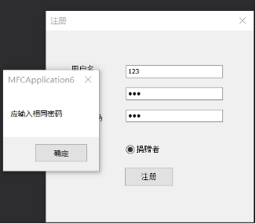 

 

 

登录界面：（输入错误密码的提示）

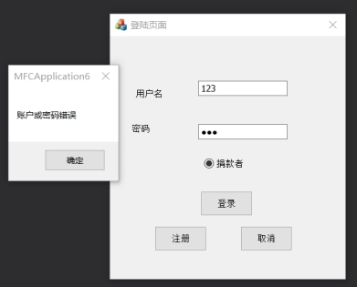 

主菜单：

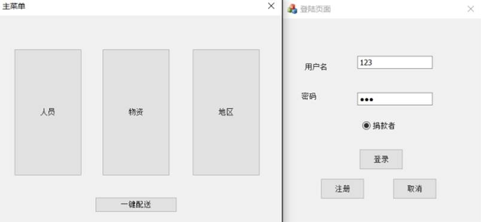 

人员界面：（人员新增界面）

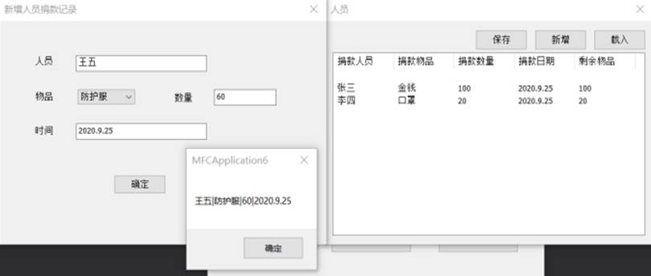 

仓库界面：

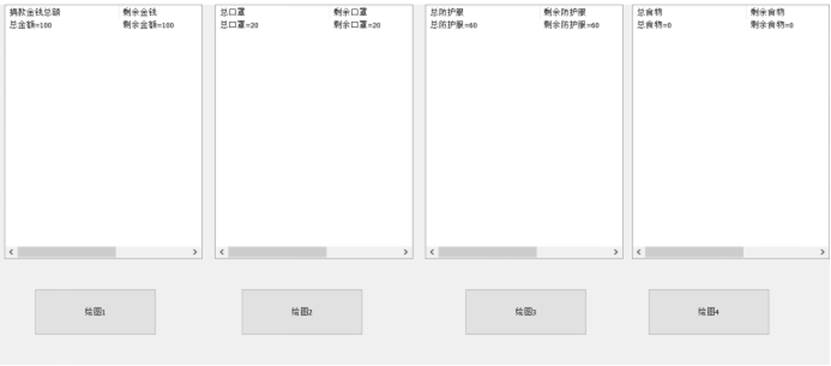 

地区需求界面：（新增地区需求界面）

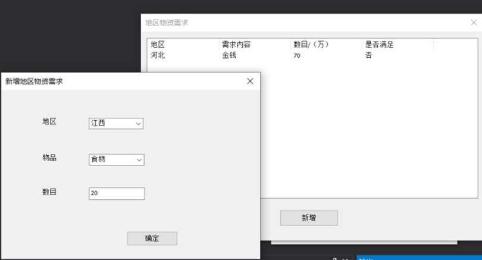 一键配送界面：

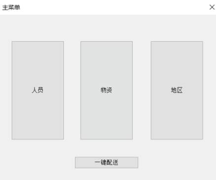 

地区需求界面信息变化：

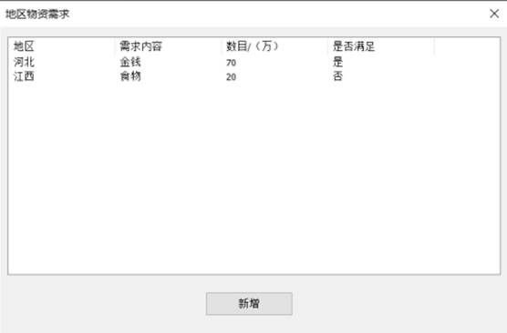 

人员信息界面信息变化：

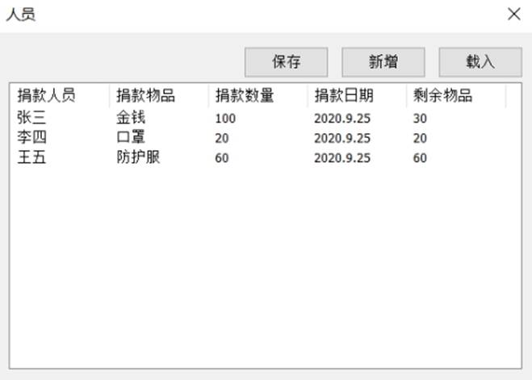 

仓库信息柱状图显示：

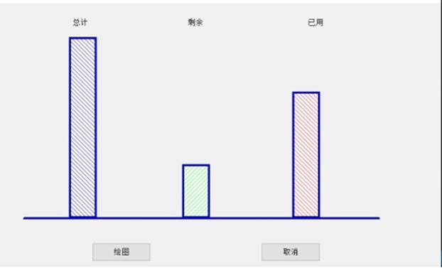 

再新增人员捐赠信息，满足未满足需求：

 

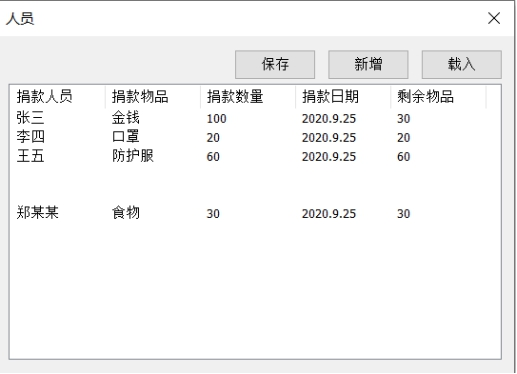 

地区需求界面信息变化：

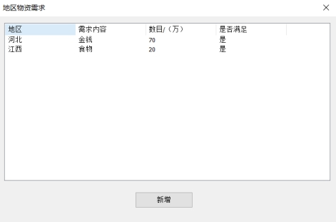 

## 设计与架构

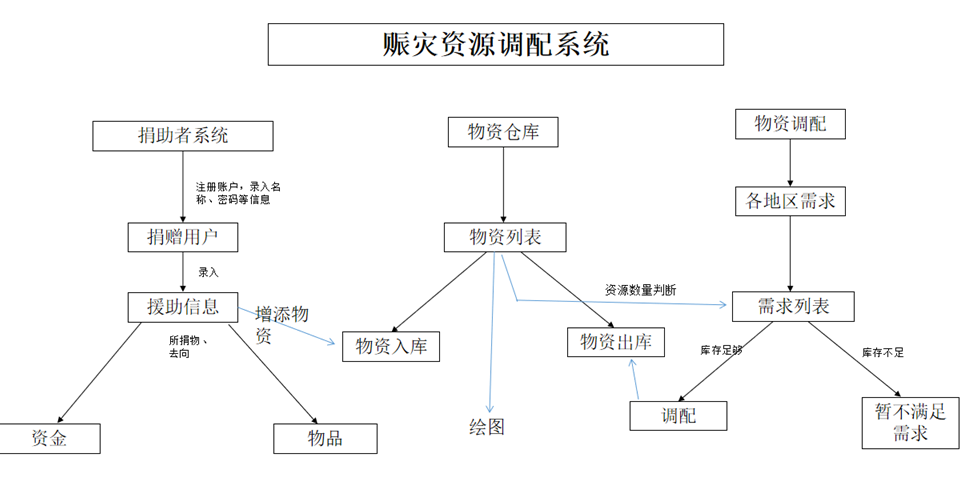

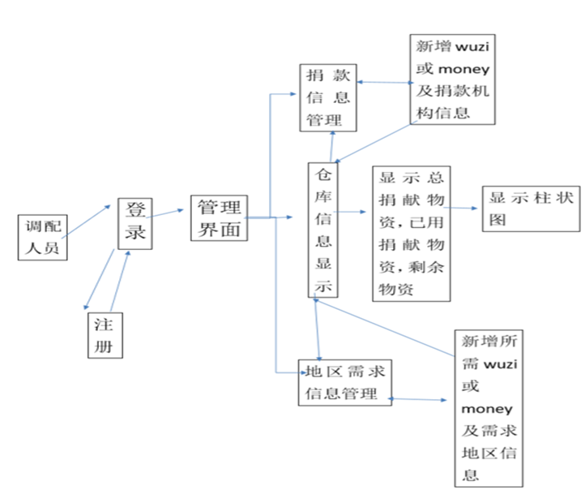

## 数据结构设计

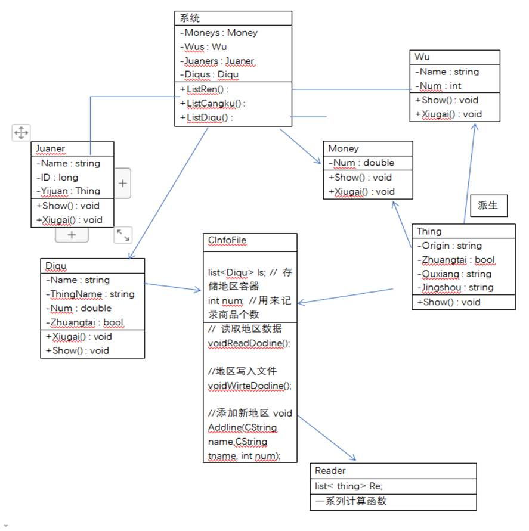